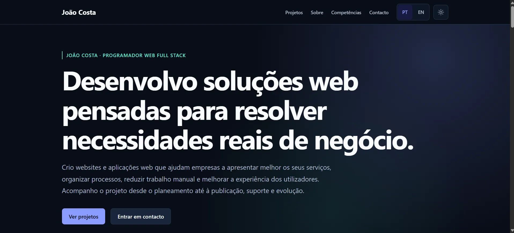

<p align="center">
  
</p>

# João Costa — Portefólio profissional / Professional portfolio

[Português](#português) · [English](#english)

## Português

### João Costa — Programador Web Full Stack

Desenvolvo aplicações web que transformam necessidades reais de negócio em produtos funcionais, acompanhando todo o processo desde a primeira conversa de levantamento de requisitos até ao desenvolvimento frontend e backend, publicação, manutenção e suporte. Este repositório é o código-fonte do meu portefólio profissional, onde apresento esse trabalho.

O portefólio é uma single-page application em React, disponível em português e em inglês, com tema claro/escuro e layout responsivo.

[GitHub](https://github.com/JoaoMiguelCosta) · [LinkedIn](https://www.linkedin.com/in/jo%C3%A3o-miguel-costa1/) · [Email](mailto:joaoxxmiguel@hotmail.com)

### Live demo

[joaomiguelcosta.pt](https://joaomiguelcosta.pt/)

### Funcionalidades principais

- Homepage única com secções: Hero, Projetos, Sobre, Competências e Contacto, com navegação por âncoras.
- Português e inglês, com deteção do idioma do browser, persistência em `localStorage` e troca sem recarregar a página.
- Tema claro e escuro, com persistência em `localStorage`, deteção da preferência do sistema e script inline no `index.html` que aplica o tema antes da primeira renderização (evita flash de tema errado).
- Cartões de projeto com tecnologias, responsabilidade no projeto e ligações para o website e o repositório.
- Modal de "Dados de acesso" para o projeto Farmácia Santa Casa, com credenciais de demonstração (contas não administrativas) e botão de copiar para cada campo.
- Página 404 e página de erro de routing, ambas com texto localizado.
- Menu mobile acessível: fecha com Escape, fecha ao clicar fora e devolve o foco ao botão que o abriu.

### Projetos em destaque

Os dois projetos assinalados como destaque no portefólio (`featured: true` em `src/data/projects.data.js`):

#### Farmácia Santa Casa

Aplicação web full stack para gestão operacional entre uma instituição (Santa Casa), uma farmácia e uma área de sistema/admin, cobrindo utentes, receitas, pedidos, regularizações e alertas.

Frontend em React e Vite; backend em Node.js, Express, Prisma e PostgreSQL.

[Ver demonstração](https://farmacia-santacasa-frontend-staging.onrender.com/) · [Repositório](https://github.com/JoaoMiguelCosta/farmacia-santa-casa-app)

O primeiro carregamento pode demorar alguns segundos por estar alojado numa instância gratuita do Render. As credenciais de acesso de demonstração estão disponíveis diretamente no cartão do projeto, através do botão "Dados de acesso".

#### Sunlive Group

Aplicação institucional multi-marca (Group, Travel, Sports e Hotel) construída sobre uma única base de código, com identidade visual própria por marca e navegação consistente.

[Website](https://sunlive-group.vercel.app/sunlive-group) · [Repositório](https://github.com/JoaoMiguelCosta/Sunlive-Group)

#### Outros projetos

| Projeto | Tipo | Foco principal | Links |
|---|---|---|---|
| Ria Canal Hair Design | Website institucional | Apresentação do salão, serviços e testemunhos | [Website](https://www.riacanalhairdesign.pt/) · [Repositório](https://github.com/JoaoMiguelCosta/RiaCanalHairDesign) |
| WAG Training Camp | Website de evento | Promoção e inscrições de camps internacionais de ginástica | [Website](https://www.wagtrainingcamp.sunlive.pt/) · [Repositório](https://github.com/JoaoMiguelCosta/wag-training-camp-sunlive) |
| International Continental Cup | Website de competição | Informação do evento, alojamento e inscrições | [Website](https://continentalcup.sunlive.pt/) · [Repositório](https://github.com/JoaoMiguelCosta/continental-cup-sunlive) |

Estes cartões de projeto vivem apenas na homepage — o portefólio não tem páginas dedicadas de detalhe/case study por projeto. As rotas antigas `/projetos` e `/projects` (de uma versão anterior do site) continuam a existir e redirecionam para as respetivas âncoras na homepage.

### Tecnologias

| Área | Tecnologia |
|---|---|
| Interface | React 19 |
| Routing | React Router 7 |
| Build | Vite 8 |
| Estilos | CSS Modules |
| Qualidade de código | ESLint 10 |
| Publicação | Vercel |

Esta tabela descreve a stack do próprio portefólio. Os projetos individuais, como a Farmácia Santa Casa, usam tecnologias adicionais descritas nas respetivas secções acima.

### Arquitetura e organização

O código separa conteúdo, configuração e apresentação:

- `src/data` guarda o conteúdo em bruto (perfil, projetos, competências), sem texto de interface.
- `src/i18n` guarda o idioma ativo, o routing localizado (âncoras traduzidas) e as traduções, divididas por idioma e por domínio de conteúdo (`header`, `footer`, `feedback`, `home/*`) em vez de um único ficheiro extenso.
- Cada página combina `src/data` com as traduções através da sua própria camada `config` (por exemplo, `src/pages/HomePage/config/projects.config.js`), produzindo os dados já prontos a renderizar.
- `src/pages` contém as páginas, organizadas por secção quando aplicável (ex.: `HomePage/sections/ProjectsSection`).
- `src/shared` reúne layouts, UI partilhada e helpers de routing usados por mais do que uma parte da aplicação.
- `src/theme` isola por completo o estado do tema, o armazenamento e a deteção da preferência do sistema.

### Internacionalização

- Idiomas suportados: português (`pt`, valor por omissão) e inglês (`en`).
- Idioma inicial: valor guardado em `localStorage` (`portfolio-language`) ou, na ausência deste, o idioma do browser (`navigator.language`), com fallback para português.
- `document.documentElement.lang` é atualizado para `pt-PT` ou `en` sempre que o idioma muda.
- As âncoras internas (`#projetos`/`#projects`, `#sobre`/`#about`, etc.) são traduzidas por idioma; o componente `LocalizedRouteSync` corrige automaticamente o hash da URL se este não corresponder ao idioma atual.
- Os títulos de página (`document.title`) e os textos de interface são traduzidos; o CV descarregável também difere por idioma (`joao-costa-cv-pt.pdf` / `joao-costa-cv-en.pdf`).

### Tema claro e escuro

- Tema inicial: valor guardado em `localStorage` (`portfolio-theme`) ou, na ausência deste, `prefers-color-scheme` do sistema.
- Um script inline no `<head>` do `index.html` aplica o atributo `data-theme` ao elemento `<html>` antes da primeira renderização React, para evitar um flash do tema errado.
- Enquanto não existir preferência guardada, uma alteração da preferência do sistema atualiza o tema automaticamente.
- As cores estão centralizadas em custom properties (`src/styles/tokens.css`), com um bloco `:root[data-theme="dark"]` a sobrepor os valores para o tema escuro.

### Responsividade e acessibilidade

- Layout responsivo com breakpoints dedicados em `rem` em cada módulo CSS (header, hero, cartões de projeto, competências, contacto, footer), incluindo uma estratégia de CSS subgrid para alinhar as secções dos dois cartões de projeto em destaque lado a lado.
- Skip link para o conteúdo principal, landmarks semânticos (`header`, `nav`, `main`, `footer`, `section`/`aside` com `aria-label`/`aria-labelledby`).
- Menu mobile com `aria-expanded`, `aria-controls`, fecho com Escape, fecho ao clicar fora e foco devolvido ao botão que o abriu.
- Toggles de tema e idioma com `aria-pressed`/`aria-label` a refletir o estado atual.
- Modal de dados de acesso construído sobre o elemento nativo `<dialog>`, com foco movido para o botão de fechar ao abrir e região `aria-live` para feedback de "copiado".
- Suporte a `prefers-reduced-motion` (scroll suave, transições de cor e a animação de hover das imagens dos cartões são desativadas quando o utilizador prefere menos movimento).
- Esta auditoria não inclui uma validação visual automatizada em múltiplas larguras nem um teste formal de conformidade WCAG — os pontos acima refletem o que está implementado no código, não uma certificação de acessibilidade.

### Estrutura do projeto

```
src/
  app/       # configuração de routing e composição da aplicação
  data/      # conteúdo do portefólio: perfil, projetos e competências
  i18n/      # idioma, routing localizado e traduções
  pages/     # páginas e respetivas secções
  shared/    # layouts, componentes partilhados e helpers de routing
  styles/    # design tokens, reset e estilos globais
  theme/     # funcionamento dos temas claro e escuro
public/      # assets estáticos: imagens, ícones e documentos
```

### Desenvolvimento local

```
npm install
npm run dev
```

O servidor de desenvolvimento arranca por defeito em `http://localhost:5173`.

### Scripts disponíveis

Scripts definidos em `package.json`:

- `npm run dev` — inicia o servidor de desenvolvimento do Vite.
- `npm run build` — cria uma build de produção em `dist/`.
- `npm run lint` — executa o ESLint em todo o projeto.
- `npm run preview` — serve localmente a build de produção já gerada.

Não existe atualmente nenhum script de testes automatizados nem variáveis de ambiente necessárias para correr o projeto.

### Build e publicação

O repositório está preparado para publicação na Vercel. O ficheiro `vercel.json` reescreve todos os pedidos para `index.html`, para que uma atualização direta numa rota como `/projetos` ou `/projects` seja corretamente resolvida pela SPA em vez de devolver 404.

### Estado atual do projeto

- O site está publicado e funcional na URL do live demo acima.

### Contacto

Estou disponível para projetos freelance, colaboração part-time e parcerias técnicas com equipas de desenvolvimento. Se quiseres falar sobre uma oportunidade ou um projeto, contacta através do [LinkedIn](https://www.linkedin.com/in/jo%C3%A3o-miguel-costa1/) ou por [email](mailto:joaoxxmiguel@hotmail.com).

---

## English

### João Costa — Full-Stack Web Developer

I build web applications that turn real business needs into working products, from the first requirements conversation through frontend and backend development, deployment, maintenance and support. This repository is the source code of my professional portfolio, where I present that work.

The portfolio is a React single-page application, available in Portuguese and English, with light/dark theming and a responsive layout.

[GitHub](https://github.com/JoaoMiguelCosta) · [LinkedIn](https://www.linkedin.com/in/jo%C3%A3o-miguel-costa1/) · [Email](mailto:joaoxxmiguel@hotmail.com)

### Live demo

[joaomiguelcosta.pt](https://joaomiguelcosta.pt/)

### Key features

- Single homepage with Hero, Projects, About, Skills and Contact sections, navigated via in-page anchors.
- Portuguese and English, with browser-language detection, `localStorage` persistence and switching without a page reload.
- Light and dark theme, persisted in `localStorage`, with system-preference detection and an inline script in `index.html` that applies the theme before the first React render (avoids a flash of the wrong theme).
- Project cards showing technologies, my responsibility on the project, and links to the live website and repository.
- A "Demo access" modal for the Farmácia Santa Casa project, with demo credentials (non-administrative accounts) and a copy button for each field.
- A 404 page and a routing error page, both fully localised.
- An accessible mobile menu: closes on Escape, closes on outside click, and returns focus to the button that opened it.

### Selected work

The two projects flagged as featured in the portfolio data (`featured: true` in `src/data/projects.data.js`):

#### Farmácia Santa Casa

A full-stack web application for operational management between an institution (Santa Casa), a pharmacy and a system/admin area, covering residents, prescriptions, orders, regularisations and alerts.

Frontend built with React and Vite; backend with Node.js, Express, Prisma and PostgreSQL.

[Demo](https://farmacia-santacasa-frontend-staging.onrender.com/) · [Repository](https://github.com/JoaoMiguelCosta/farmacia-santa-casa-app)

The first load can take a few seconds since it runs on a free Render instance. Demo credentials are available directly on the project card via the "Demo access" button.

#### Sunlive Group

A multi-brand institutional application (Group, Travel, Sports and Hotel) built on a single codebase, with its own visual identity per brand and consistent navigation.

[Website](https://sunlive-group.vercel.app/sunlive-group) · [Repository](https://github.com/JoaoMiguelCosta/Sunlive-Group)

#### Other projects

| Project | Type | Main focus | Links |
|---|---|---|---|
| Ria Canal Hair Design | Corporate website | Salon presentation, services and testimonials | [Website](https://www.riacanalhairdesign.pt/) · [Repository](https://github.com/JoaoMiguelCosta/RiaCanalHairDesign) |
| WAG Training Camp | Event website | International gymnastics camp promotion and registration | [Website](https://www.wagtrainingcamp.sunlive.pt/) · [Repository](https://github.com/JoaoMiguelCosta/wag-training-camp-sunlive) |
| International Continental Cup | Competition website | Event information, accommodation and registration | [Website](https://continentalcup.sunlive.pt/) · [Repository](https://github.com/JoaoMiguelCosta/continental-cup-sunlive) |

These project cards live on the homepage only — the portfolio has no dedicated per-project detail/case-study pages. The old `/projetos` and `/projects` routes (from an earlier version of the site) still exist and redirect to the corresponding homepage anchors.

### Technology

| Area | Technology |
|---|---|
| UI | React 19 |
| Routing | React Router 7 |
| Build | Vite 8 |
| Styling | CSS Modules |
| Code quality | ESLint 10 |
| Deployment | Vercel |

This table describes the portfolio's own stack. Individual projects, such as Farmácia Santa Casa, use additional technologies described in their own sections above.

### Architecture and organisation

The codebase separates content, configuration and presentation:

- `src/data` holds raw content (profile, projects, skills), with no UI copy.
- `src/i18n` holds the active language, localised routing (translated anchors) and translations, split by language and by content domain (`header`, `footer`, `feedback`, `home/*`) instead of one large file.
- Each page combines `src/data` with translations through its own `config` layer (e.g. `src/pages/HomePage/config/projects.config.js`), producing render-ready data.
- `src/pages` contains the pages, organised into sections where relevant (e.g. `HomePage/sections/ProjectsSection`).
- `src/shared` holds layouts, shared UI and routing helpers used by more than one part of the app.
- `src/theme` fully isolates theme state, storage and system-preference detection.

### Internationalisation

- Supported languages: Portuguese (`pt`, default) and English (`en`).
- Initial language: the value stored in `localStorage` (`portfolio-language`), or the browser's language (`navigator.language`) when nothing is stored, falling back to Portuguese.
- `document.documentElement.lang` is updated to `pt-PT` or `en` whenever the language changes.
- In-page anchors (`#projetos`/`#projects`, `#sobre`/`#about`, etc.) are translated per language; the `LocalizedRouteSync` component automatically corrects the URL hash if it doesn't match the current language.
- Page titles (`document.title`) and UI copy are translated; the downloadable CV also differs by language (`joao-costa-cv-pt.pdf` / `joao-costa-cv-en.pdf`).

### Light and dark theme

- Initial theme: the value stored in `localStorage` (`portfolio-theme`), or the system's `prefers-color-scheme` when nothing is stored.
- An inline script in the `index.html` `<head>` sets the `data-theme` attribute on `<html>` before the first React render, avoiding a flash of the wrong theme.
- While no preference is stored, a change in the system preference updates the theme automatically.
- Colours are centralised as custom properties (`src/styles/tokens.css`), with a `:root[data-theme="dark"]` block overriding values for the dark theme.

### Responsiveness and accessibility

- Responsive layout with dedicated `rem`-based breakpoints in each CSS module (header, hero, project cards, skills, contact, footer), including a CSS subgrid strategy that aligns the two featured project cards' internal sections side by side.
- Skip link to the main content, semantic landmarks (`header`, `nav`, `main`, `footer`, `section`/`aside` with `aria-label`/`aria-labelledby`).
- Mobile menu with `aria-expanded`, `aria-controls`, closes on Escape, closes on outside click, and returns focus to the button that opened it.
- Theme and language toggles with `aria-pressed`/`aria-label` reflecting current state.
- The demo access modal is built on the native `<dialog>` element, moving focus to the close button on open and using an `aria-live` region for "copied" feedback.
- `prefers-reduced-motion` support (smooth scrolling, colour transitions and the project card image hover animation are disabled when the user prefers reduced motion).
- This audit did not include automated visual validation across multiple viewport widths or a formal WCAG conformance test — the points above reflect what is implemented in the code, not an accessibility certification.

### Project structure

```
src/
  app/       # routing setup and application composition
  data/      # portfolio content: profile, projects and skills
  i18n/      # language runtime, localised routing and translations
  pages/     # page-level views, organised by section
  shared/    # layouts, shared UI components and routing helpers
  styles/    # design tokens, reset and global styles
  theme/     # light/dark theme runtime
public/      # static assets: images, icons and documents
```

### Local development

```
npm install
npm run dev
```

The development server runs at `http://localhost:5173` by default.

### Available scripts

Scripts defined in `package.json`:

- `npm run dev` — starts the Vite development server.
- `npm run build` — creates a production build in `dist/`.
- `npm run lint` — runs ESLint across the project.
- `npm run preview` — serves the already-built production build locally.

There is currently no automated test script and no environment variables required to run the project.

### Build and deployment

The repository is prepared for deployment on Vercel. `vercel.json` rewrites all requests to `index.html`, so that a direct refresh on a route such as `/projetos` or `/projects` is correctly resolved by the SPA instead of returning a 404.

### Current project status

- The site is deployed and functional at the live demo URL above.

### Contact

I'm open to freelance projects, part-time collaboration and technical partnerships with development teams. If you'd like to talk about an opportunity or a project, reach out through [LinkedIn](https://www.linkedin.com/in/jo%C3%A3o-miguel-costa1/) or by [email](mailto:joaoxxmiguel@hotmail.com).
