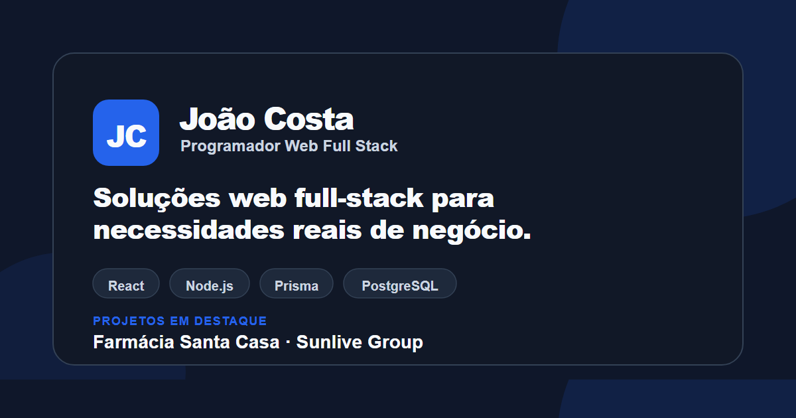

<p align="center">
  
</p>

# João Costa — Portefólio profissional / Professional portfolio

[Português](#português) · [English](#english)

## Português

### João Costa — Programador Web Full Stack

Desenvolvo aplicações web que transformam necessidades reais de negócio em produtos funcionais, acompanhando todo o processo desde a primeira conversa de levantamento de requisitos até ao desenvolvimento frontend e backend, publicação, manutenção e suporte. Este repositório é o código-fonte do meu portefólio profissional, onde apresento esse trabalho em detalhe.

O próprio portefólio está disponível em português e em inglês, com rotas e conteúdo totalmente localizados.

[GitHub](https://github.com/JoaoMiguelCosta) · [LinkedIn](https://www.linkedin.com/in/jo%C3%A3o-miguel-costa1/) · [Email](mailto:joaoxxmiguel@hotmail.com)

### Visão geral

Este é um portefólio profissional criado para apresentar experiência prática, projetos reais e uma forma de trabalhar consistente. Destina-se a recrutadores, potenciais clientes e a outros programadores que analisem o código. Para além de uma galeria de projetos, inclui estudos de caso detalhados que cobrem contexto, responsabilidades, decisões técnicas e resultados dos dois projetos principais.

### Projetos em destaque

#### Farmácia Santa Casa

Aplicação web Full Stack para gestão operacional entre uma instituição (Santa Casa), uma farmácia e uma área de Sistema/Admin. Trata utentes, receitas, pedidos, regularizações e alertas, com permissões por perfil e autenticação JWT armazenada num cookie HTTP-only.

O frontend foi construído com React e Vite; o backend com Node.js, Express, Prisma e PostgreSQL.

Está disponível um ambiente público de demonstração. Por estar alojado numa instância gratuita do Render, o primeiro carregamento pode demorar alguns segundos. As credenciais de acesso estão disponíveis no estudo de caso do portefólio e correspondem apenas a contas não administrativas.

[Ver demonstração](https://farmacia-santacasa-frontend-staging.onrender.com/) · [Repositório](https://github.com/JoaoMiguelCosta/farmacia-santa-casa-app)

#### Sunlive Group

Aplicação institucional SPA multi-marca que reúne várias áreas de negócio — Group, Travel, Sports e Hotel — numa única base de código, cada uma com identidade visual própria e navegação consistente. O trabalho abrangeu arquitetura frontend, componentes partilhados, navegação responsiva para desktop/mobile e um sistema visual baseado em design tokens.

[Website](https://sunlive-group.vercel.app/sunlive-group) · [Repositório](https://github.com/JoaoMiguelCosta/Sunlive-Group)

#### Outros projetos

| Projeto | Tipo | Foco principal | Links |
|---|---|---|---|
| Ria Canal Hair Design | Website institucional | Apresentação do salão, serviços e testemunhos | [Website](https://www.riacanalhairdesign.pt/) · [Repositório](https://github.com/JoaoMiguelCosta/RiaCanalHairDesign) |
| WAG Training Camp | Website de evento | Promoção e inscrições de camps internacionais de ginástica | [Website](https://www.wagtrainingcamp.sunlive.pt/) · [Repositório](https://github.com/JoaoMiguelCosta/wag-training-camp-sunlive) |
| International Continental Cup | Website de competição | Informação do evento, alojamento e inscrições | [Website](https://continentalcup.sunlive.pt/) · [Repositório](https://github.com/JoaoMiguelCosta/continental-cup-sunlive) |

### O que este portefólio demonstra

- Desenvolvimento de interfaces responsivas, revistas manualmente em diferentes breakpoints.
- Localização completa em português e inglês, incluindo rotas de projeto e âncoras internas localizadas.
- Temas claro e escuro, com persistência da preferência do utilizador e fallback para a preferência do sistema.
- Navegação acessível: landmarks semânticos, skip link, foco visível pelo teclado e controlos identificados com estado programático (como botões de alternância).
- Suporte a movimento reduzido para utilizadores que o preferem.
- Conteúdo estruturado em componentes reutilizáveis e de responsabilidade única, em vez de ficheiros de página extensos.
- Estudos de caso detalhados, distintos dos cartões compactos de projeto na página inicial.
- Descarregamento de CV (português e inglês) e certificado, cada um identificado com documento, idioma e formato.
- Metadados Open Graph e Twitter Card, URL canónico e imagem social para partilha de links.
- Organização de assets e build preparada para publicação em produção na Vercel.

### Tecnologias

| Área | Tecnologia |
|---|---|
| Interface | React 19 |
| Routing | React Router 7 |
| Build | Vite 8 |
| Estilos | CSS Modules |
| Qualidade de código | ESLint 10 |
| Publicação | Vercel |

Esta tabela descreve a stack do próprio portefólio. Os projetos individuais, como a Farmácia Santa Casa, usam tecnologias adicionais descritas nas respetivas secções acima.

### Abordagem de desenvolvimento

O código separa conteúdo, configuração e apresentação: os dados residem em `src/data`, cada página combina esses dados com as traduções através da sua própria camada de configuração, e os componentes mantêm-se focados na apresentação. As páginas estão organizadas por secção, com UI partilhada em `src/shared` apenas quando mais do que uma parte da aplicação precisa efetivamente dela.

A internacionalização está dividida por idioma e por domínio de conteúdo, em vez de um único ficheiro de traduções extenso, e o routing localizado está isolado do resto da aplicação. O tema segue a mesma lógica: um único módulo autónomo é responsável pelo estado do tema, pelo armazenamento e pela deteção da preferência do sistema. Ao longo do projeto, as abstrações só foram introduzidas quando resolviam um problema concreto de duplicação ou de responsabilidade, não por definição.

### Estrutura do projeto

```
src/
  app/       # configuração de routing e composição da aplicação
  data/      # conteúdo do portefólio: perfil, projetos e competências
  i18n/      # idioma, routing localizado e traduções
  pages/     # páginas e respetivas secções
  shared/    # layouts, componentes partilhados e helpers de routing
  styles/    # design tokens, reset e estilos globais
  theme/     # funcionamento dos temas claro e escuro
public/      # assets estáticos: imagens, ícones e documentos
```

### Desenvolvimento local

```
npm install
npm run dev
```

O servidor de desenvolvimento arranca por defeito em `http://localhost:5173`.

### Scripts disponíveis

- `npm run dev` — inicia o servidor de desenvolvimento do Vite com hot module reload.
- `npm run lint` — executa o ESLint em todo o projeto.
- `npm run build` — cria uma build de produção otimizada em `dist/`.
- `npm run preview` — serve localmente a build de produção para verificação.

### Qualidade, acessibilidade e SEO

O projeto inclui uma base orientada à acessibilidade, mas não reivindica certificação formal de conformidade com as WCAG. Na prática, isto significa landmarks semânticos, um skip link para o conteúdo principal, foco visível pelo teclado, navegação identificada, estados acessíveis nos toggles e suporte a movimento reduzido, além de alternativas textuais relevantes para as imagens.

Ao nível de SEO e metadados, o site inclui etiquetas Open Graph e Twitter Card, um URL canónico, um favicon e uma imagem social dedicada. A qualidade de código é garantida através do ESLint, e cada alteração é validada com uma build de produção antes de ser considerada concluída.

### Publicação

O repositório está preparado para publicação na Vercel. O ficheiro `vercel.json` inclui a configuração de rewrite necessária para uma aplicação de página única (SPA), para que atualizações diretas em rotas localizadas como `/projetos` e `/projects` sejam corretamente resolvidas em vez de devolverem um erro 404. O domínio de produção previsto é `joao-miguel-costa.pt`.

### Contacto

Estou disponível para projetos freelance, colaboração part-time e parcerias técnicas com equipas de desenvolvimento. Se quiseres falar sobre uma oportunidade ou um projeto, contacta através do [LinkedIn](https://www.linkedin.com/in/jo%C3%A3o-miguel-costa1/) ou por [email](mailto:joaoxxmiguel@hotmail.com).

---

## English

### João Costa — Full-Stack Web Developer

I build web applications that turn real business needs into working products, from the first requirements conversation through frontend and backend development, deployment, maintenance and support. This repository is the source code of my professional portfolio, where I present that work in detail.

The portfolio itself is available in Portuguese and English, with fully localised routes and content.

[GitHub](https://github.com/JoaoMiguelCosta) · [LinkedIn](https://www.linkedin.com/in/jo%C3%A3o-miguel-costa1/) · [Email](mailto:joaoxxmiguel@hotmail.com)

### Overview

This is a professional portfolio built to present practical experience, real projects and a consistent way of working. It is aimed at recruiters, potential clients and other developers reviewing the code. Beyond a project gallery, it includes detailed case studies covering context, responsibilities, technical decisions and outcomes for the two main projects.

### Selected Work

#### Farmácia Santa Casa

A full-stack web application for operational management between an institution (Santa Casa), a pharmacy and a system/admin area. It handles residents, prescriptions, orders, regularisations and alerts, with role-based permissions and JWT authentication stored in an HTTP-only cookie.

The frontend is built with React and Vite; the backend with Node.js, Express, Prisma and PostgreSQL.

A public demo environment is available. As it runs on a free Render instance, the first load can take a few seconds. Demo credentials are provided in the case study on the portfolio and are intentionally scoped to non-administrative accounts.

[Demo](https://farmacia-santacasa-frontend-staging.onrender.com/) · [Repository](https://github.com/JoaoMiguelCosta/farmacia-santa-casa-app)

#### Sunlive Group

A multi-brand institutional single-page application bringing together several business areas — Group, Travel, Sports and Hotel — under one codebase, each with its own visual identity and consistent navigation. The work covered frontend architecture, shared components, responsive desktop/mobile navigation and a visual system based on design tokens.

[Website](https://sunlive-group.vercel.app/sunlive-group) · [Repository](https://github.com/JoaoMiguelCosta/Sunlive-Group)

#### Other Projects

| Project | Type | Main focus | Links |
|---|---|---|---|
| Ria Canal Hair Design | Corporate website | Salon presentation, services and testimonials | [Website](https://www.riacanalhairdesign.pt/) · [Repository](https://github.com/JoaoMiguelCosta/RiaCanalHairDesign) |
| WAG Training Camp | Event website | International gymnastics camp promotion and registration | [Website](https://www.wagtrainingcamp.sunlive.pt/) · [Repository](https://github.com/JoaoMiguelCosta/wag-training-camp-sunlive) |
| International Continental Cup | Competition website | Event information, accommodation and registration | [Website](https://continentalcup.sunlive.pt/) · [Repository](https://github.com/JoaoMiguelCosta/continental-cup-sunlive) |

### What This Portfolio Demonstrates

- Responsive interface development, reviewed manually across breakpoints.
- Full Portuguese and English localisation, including localised project routes and in-page anchors.
- Light and dark themes with a persisted user preference and a fallback to system settings.
- Accessible navigation: semantic landmarks, a skip link, visible keyboard focus and labelled controls with programmatic state (such as toggle buttons).
- Reduced-motion support for users who prefer it.
- Structured content with reusable, single-purpose components rather than large page-level files.
- Detailed project case studies, separate from the compact project cards on the homepage.
- Downloadable CV (Portuguese and English) and certificate, each clearly labelled with document, language and format.
- Open Graph and Twitter Card metadata, a canonical URL and a social preview image for link sharing.
- An asset and build setup organised for a production deployment on Vercel.

### Technology

| Area | Technology |
|---|---|
| UI | React 19 |
| Routing | React Router 7 |
| Build | Vite 8 |
| Styling | CSS Modules |
| Code quality | ESLint 10 |
| Deployment | Vercel |

This table describes the portfolio's own stack. Individual projects, such as Farmácia Santa Casa, use additional technologies described in their own sections above.

### Engineering Approach

The codebase separates content, configuration and presentation: raw data lives in `src/data`, each page combines that data with translations through its own configuration layer, and components stay focused on rendering. Pages are organised by section, with shared UI kept in `src/shared` only when more than one part of the app actually needs it.

Internationalisation is split by language and by content domain instead of a single large translation file, and localised routing is isolated from the rest of the application. Theming follows the same idea: a single, self-contained module owns theme state, storage and system-preference detection. Throughout the project, abstractions were introduced only where they solved a concrete duplication or responsibility problem, not by default.

### Project Structure

```
src/
  app/       # routing setup and application composition
  data/      # portfolio content: profile, projects and skills
  i18n/      # language runtime, localised routing and translations
  pages/     # page-level views, organised by section
  shared/    # layouts, shared UI components and routing helpers
  styles/    # design tokens, reset and global styles
  theme/     # light/dark theme runtime
public/      # static assets: images, icons and documents
```

### Local Development

```
npm install
npm run dev
```

The development server runs at `http://localhost:5173` by default.

### Available Scripts

- `npm run dev` — starts the Vite development server with hot module reload.
- `npm run lint` — runs ESLint across the project.
- `npm run build` — creates an optimised production build in `dist/`.
- `npm run preview` — serves the production build locally for verification.

### Quality, Accessibility and SEO

The project includes an accessibility-focused foundation, but it does not claim formal WCAG certification. In practice, this means semantic landmarks, a skip-to-content link, visible keyboard focus, labelled navigation, accessible toggle states and support for reduced motion, alongside meaningful alternative text for images.

On the SEO and metadata side, the site ships with Open Graph and Twitter Card tags, a canonical URL, a favicon and a dedicated social preview image. Code quality is enforced through ESLint, and every change is validated against a production build before being considered complete.

### Deployment

The repository is prepared for deployment on Vercel. `vercel.json` includes the rewrite configuration required for a single-page application, so that direct refreshes on localised routes such as `/projetos` and `/projects` resolve correctly instead of returning a 404. The planned production domain is `joao-miguel-costa.pt`.

### Contact

I'm open to freelance projects, part-time collaboration and technical partnerships with development teams. If you'd like to talk about an opportunity or a project, reach out through [LinkedIn](https://www.linkedin.com/in/jo%C3%A3o-miguel-costa1/) or by [email](mailto:joaoxxmiguel@hotmail.com).
